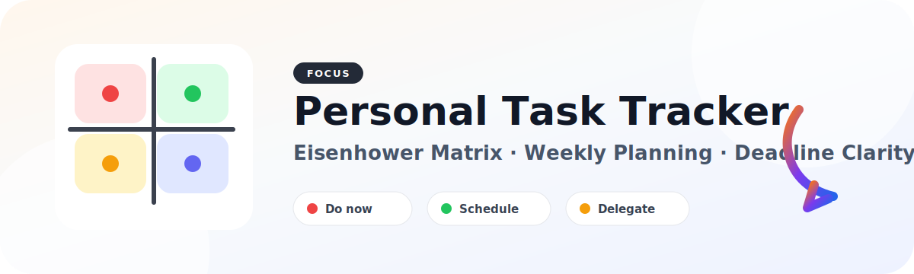

# Personal Task Tracker — Eisenhower Matrix



A simple task management web app based on the Eisenhower Matrix. It helps you capture tasks, prioritize what matters, plan your week, and track deadlines in a warm, light-only workspace interface.

The app is password-protected and stores data locally in SQLite.

## Features

- **Eisenhower Matrix dashboard** with four quadrants:
  - Q1: Important + urgent
  - Q2: Important + not urgent
  - Q3: Not important + urgent
  - Q4: Not important + not urgent
- **Warm light workspace UI** with compact navigation, paper-like surfaces, and priority color accents.
- **Quick task creation** with title, notes, deadline, estimated duration, and energy level.
- **Automatic quadrant classification** from important/urgent flags.
- **Direct quick-add** inside each quadrant.
- **Task actions**: edit details inline, move, complete/reopen, and soft delete.
- **Weekly Planning** page for capacity planning and workload balance.
- **Q2 Focus** section to protect important non-urgent tasks before they become urgent.
- **Energy-aware suggestions** to pick tasks based on your current energy level.
- **Notifications page** for overdue, due-today, and due-tomorrow tasks.
- **Calendar views** by day, week, month, and year.
- **History page** for active, completed, and deleted tasks.
- **Settings page** for updating login credentials.

## Tech Stack

- Python
- FastAPI
- SQLite
- Jinja templates
- CSS
- Pytest

## Project Structure

```text
.
├── app/
│   ├── core.py
│   └── main.py
├── static/
│   ├── project-icon.svg
│   ├── signature.svg
│   └── styles.css
├── templates/
│   ├── login.html
│   ├── dashboard.html
│   ├── weekly_plan.html
│   ├── notifications.html
│   ├── calendar.html
│   ├── history.html
│   └── settings.html
├── tests/
│   ├── test_core.py
│   └── test_app.py
├── requirements.txt
└── README.md
```

## Getting Started

Clone the repository:

```bash
git clone https://github.com/Thailee2710/Personal-task-tracker-Eisenhower.git
cd Personal-task-tracker-Eisenhower
```

Create and activate a virtual environment:

```bash
python3 -m venv .venv
source .venv/bin/activate
```

Install dependencies:

```bash
pip install -r requirements.txt
```

Create an environment file:

```bash
cp .env.example .env
```

Example `.env`:

```bash
EISENHOWER_DB_PATH=./data/tasks.sqlite
EISENHOWER_ADMIN_USER=admin
EISENHOWER_ADMIN_PASSWORD=change-this-password
EISENHOWER_SECRET_KEY=replace-with-a-random-secret
```

Run the app:

```bash
uvicorn app.main:app --host 127.0.0.1 --port 8090 --reload
```

Open:

```text
http://127.0.0.1:8090
```

## Main Pages

- `/` — Matrix dashboard
- `/login` — Sign in
- `/weekly-plan` — Weekly planning
- `/notifications` — Deadline notifications
- `/calendar` — Calendar views
- `/history` — Task history
- `/settings` — Account settings

## Running Tests

```bash
pytest tests -q
```

## License

MIT License. See [LICENSE](LICENSE).
